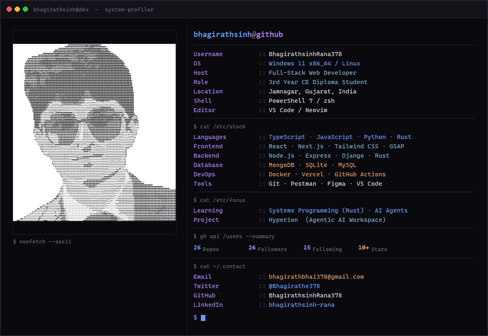

 

## ⚡ About Me

I'm **Bhagirathsinh Rana** — a Full-Stack Web Developer and 3rd-year Computer Engineering diploma student from **Jamnagar, Gujarat, India**.

I build performant web applications, desktop software, and intelligent AI tools. I'm passionate about clean architecture, system-level performance, and exploring the cutting edge of technology — from AI agents and blockchain to systems programming in Rust.

- 🔭 Currently building **[Hyperion](https://github.com/BhagirathsinhRana378/Hyperion)** — an agentic desktop workspace for parallel AI coding
- 🦀 Learning **Rust**, systems programming, and low-level concurrency
- 🤖 Exploring **AI Agents**, LLM orchestration, and developer tooling
- ⚡ Philosophy: *Building beats watching tutorials. Clean architecture always wins.*

---

## 🛠️ Tech Stack

#### Languages

#### Frontend

#### Backend

#### Database

#### DevOps & Tools

---

## 🚀 Featured Projects

### [Hyperion](https://github.com/BhagirathsinhRana378/Hyperion)
> Agentic desktop workspace for parallel AI coding. Tauri 2 desktop app + Next.js web interface with multi-workspace sidebar, tiled terminal grid, kanban task board, version-controlled prompt forge, and multi-agent orchestration.

`TypeScript` · `Tauri` · `Next.js` · `React 19` · `SQLite` · ⭐ 6 · 🍴 3

---

### [justtype](https://github.com/BhagirathsinhRana378/justtype)
> A sleek typing speed trainer. Test and improve your WPM with real-time accuracy metrics and a clean minimalist interface.

`TypeScript` · `Next.js` · `Tailwind CSS` · ⭐ 3 · [**Live Demo →**](https://justtype8.vercel.app)

---

### [SyncForge](https://github.com/BhagirathsinhRana378/SyncForge)
> Real-time collaboration platform. Synchronize code, documents, and workflows across distributed teams.

`JavaScript` · `Node.js` · `Express` · ⭐ 1

---

## 🧠 Currently Learning

- 🦀 **Rust** — Memory safety, ownership, lifetimes, and systems-level performance
- ⚙️ **Systems Programming** — Concurrency, event loops, and low-level architecture
- 🤖 **AI Agents** — LLM orchestration, context-aware code assistants, and vector embeddings
- 🖥️ **Tauri** — Lightweight native desktop apps with web frontends
- 🛠️ **Developer Tooling** — Building tools that make developers more productive

---

## 🤝 Connect With Me

&nbsp;
&nbsp;
&nbsp;

---

## ⚡ Fun Facts

- 🐛 Professional bug creator, part-time bug fixer.
- ☕ Chai goes in. Features come out.
- 🌙 "One last feature" has ruined my sleep schedule countless times.
- 🎮 God of War is installed more consistently than some of my dependencies.
- 🚀 I'd rather spend 10 hours building a project than 2 hours watching a tutorial.
- 🤔 Half my coding time is writing code. The other half is wondering why it worked.

---